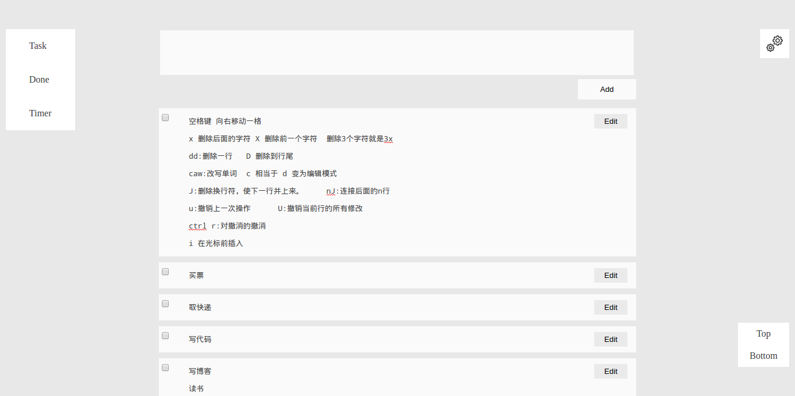
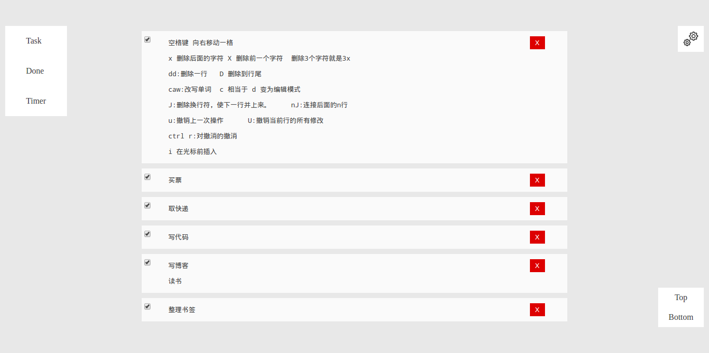
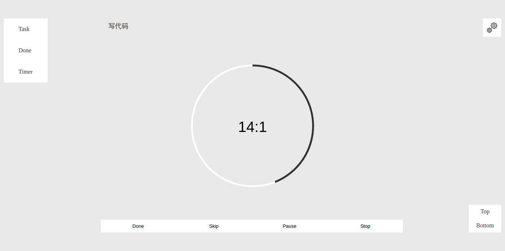

# MyKeep

本地用的备忘录、任务管理、番茄工作法时间管理网站

###ScreenShot










###功能

- 添加事项
- 编辑已添加事项
- 番茄钟
- 自定义工作时间和休息时间
- 声音提醒

###使用方法

- 数据库连接

```PHP
    $db_host="localhost:3306";//连接的服务器地址
    $db_user="keep";//连接数据库的用户名
    $db_psw="mykeep";//连接数据库的密码
    $db_name="keep";//连接的数据库名称
```

- 数据库结构
	+ 见`keep.sql`
	